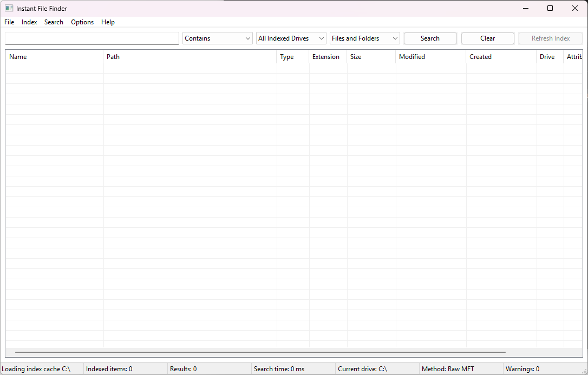

# Instant File Finder

A small, fast, native Windows desktop utility for finding files and folders by name, path, extension, size, or date.

This project started partly as a practical tool and partly as a learning exercise. I wanted to understand how NTFS file discovery works under the hood, especially raw MFT parsing and the USN journal, and see how close I could get to "instant" file searching without relying on Windows Search indexing.

The idea is simple: if the filesystem already has the metadata, then for many searches you should not need to wait for a slow recursive scan, or depend on Windows Search being enabled, up to date, or configured the way you want. This tool builds its own lightweight in-memory view of the filesystem, while still allowing live searching when no index has been built.



Written in raw Win32 C++17, built with CMake and MSVC.

## What it does

Instant File Finder searches for files and folders by:

* filename
* folder name
* full path
* extension
* size
* created date
* modified date
* drive
* attributes such as hidden/system

By default, the app works immediately without building an index. It searches live against the filesystem in the background and streams results into the list as it finds them.

For faster whole-drive searches, you can enable indexing in **Options > Preferences...** or by using any of the **Index** menu actions. The index is kept in memory while the app is running, and can also be cached under `%LocalAppData%`.

The indexing system tries a few methods, fastest first:

1. **Raw MFT parsing**
   Reads the NTFS `$MFT` directly and parses file records by hand. This is the fastest method, but normally needs the app to run as Administrator.

2. **NTFS USN journal / MFT enumeration**
   Uses the documented Windows `FSCTL_ENUM_USN_DATA` API. This is still very fast and normally works without elevation.

3. **Recursive directory scan**
   Uses ordinary `FindFirstFileExW` / `FindNextFileW` recursion. This is slower, but works everywhere and is also used for non-NTFS volumes.

The app tries the enabled methods in order for each drive. If a faster method cannot be used, for example because it needs elevation, it falls back to the next available method and shows that in the status bar.

You can search while indexing is still running. Partial results are available immediately.

## Search features

The search box supports the normal simple search cases, plus a small query syntax.

Supported match modes:

* Contains
* Starts with
* Ends with
* Exact
* Wildcard
* Regex

Example query tokens:

```text
ext:log
path:projects
drive:c
type:file
type:folder
size:>1GB
modified:today
modified:yesterday
modified:this-week
hidden:false
system:false
```

Wildcards such as `*.pdf` and `ziwa*.log` are detected automatically and switch the query to wildcard mode.

Invalid regex patterns or malformed tokens do not crash the app. Regex errors show a friendly message, and unknown `key:value` style tokens are treated as normal search text.

## Results

Results are shown in a sortable list with columns for:

* Name
* Path
* Type
* Extension
* Size
* Modified
* Created
* Drive
* Attributes
* Source

From the results list you can:

* open the selected file or folder;
* open the containing folder;
* copy the selected path;
* copy all results as tab-separated text;
* delete a selected item to the Recycle Bin.

## License

This project is licensed under the [MIT License](LICENSE).

Delete is the only action that changes anything on disk, and it always asks for confirmation first. It uses the Recycle Bin, not permanent deletion.

The status bar always shows which method is currently powering the search, for example:

```text
Method: Live scan (no index)
Method: Raw MFT
Method: NTFS USN
Method: Recursive scan
```

It also shows when the app had to fall back to a slower method.

## What it does not do

This is intentionally a file metadata finder, not a full desktop search engine.

It does not:

* search inside file contents;
* modify files, attributes, ACLs, or timestamps;
* require administrator rights for normal use;
* send telemetry;
* access the network;
* hash files;
* compute checksums;
* install a service.

Raw MFT parsing is the one feature that usually needs Administrator rights. If that is selected and cannot run normally, the app can offer to relaunch elevated, but elevation is not required just to use the app.

## Search without an index

Indexing is off by default.

On a fresh run, the app does not immediately start scanning your drives. You can simply type a query and search straight away.

In this mode, `LiveSearchManager` starts a background filesystem walk scoped to the selected drive filter, or to all eligible local drives if no drive is selected. Results are matched as the scan runs and streamed into the list incrementally.

This is slower than indexed search for broad whole-drive searches, but it has one major advantage: there is nothing to build, refresh, or keep in sync.

Turning on indexing, or using any **Index** menu action, switches searching over to the in-memory index.

## How the fast NTFS scan works

The indexed search uses the same final in-memory structure regardless of how the data was collected.

The index stores things like:

* file reference number;
* parent reference number;
* name;
* attributes;
* reconstructed full path;
* timestamps where available;
* size where available.

`IndexManager` coordinates the scan and tries the enabled methods in order for each drive.

## 1. Raw MFT parsing

Implemented in:

```text
RawMftIndexer
```

This is the fastest method and is off by default.

At a high level it does the following:

1. Opens the NTFS metadata file directly:

   ```text
   \\.\C:\$MFT
   ```

   It uses `CreateFileW` with `FILE_FLAG_BACKUP_SEMANTICS`.

2. Attempts to enable `SeBackupPrivilege` on the process token.

   This is why the method usually needs Administrator rights. A non-elevated token normally cannot enable that privilege.

3. Uses `FSCTL_GET_NTFS_VOLUME_DATA` to get details such as:

   * file record size;
   * sector size;
   * total MFT length.

4. Reads `$MFT` sequentially in large chunks using `ReadFile`.

   This is one of the main reasons this method is faster than going through the USN enumeration API record by record.

5. For each file record, it applies the NTFS update sequence array fixup and then walks the attributes manually.

   The parser pulls data from:

   * `$STANDARD_INFORMATION` for timestamps and attributes;
   * `$FILE_NAME` for parent reference, name, and size;
   * `$DATA` for real file size where present.

6. It also queries `FSCTL_QUERY_USN_JOURNAL`, so that the resulting index can later be updated through the normal incremental USN path instead of repeating the raw MFT parse.

The raw parser is deliberately defensive. Field reads are bounds-checked, unexpected records are skipped, and malformed data is not trusted.

Current v1 simplifications:

* MFT extension records are not followed.
* Files with multiple hard links only get one of their names indexed.

Those are graceful omissions, not crash cases.

## 2. NTFS USN journal / MFT enumeration

Implemented in:

```text
NtfsUsnIndexer
```

This is on by default.

This method uses documented Windows APIs and is normally fast enough for practical use.

At a high level it does the following:

1. Opens the volume, for example:

   ```text
   \\.\C:
   ```

   The handle is opened with read/write/delete sharing so it does not block normal file activity.

2. Queries the USN journal with:

   ```text
   FSCTL_QUERY_USN_JOURNAL
   ```

   This is used for cache validation and incremental update support. A missing or inactive journal does not necessarily stop the rest of the scan.

3. Enumerates live file records with:

   ```text
   FSCTL_ENUM_USN_DATA
   ```

4. Reads `USN_RECORD_V2` and `USN_RECORD_V3` records to get:

   * file/folder name;
   * attributes;
   * file reference number;
   * parent reference number.

For `USN_RECORD_V3`, the 128-bit file ID is currently truncated to 64 bits.

## Path reconstruction

Both Raw MFT and NTFS USN scanning build a map of:

```text
file reference number -> parent reference number, name, attributes
```

`PathReconstructor` then rebuilds the full path by walking each item's parent chain.

It uses caching and guards against cycles, corrupt chains, or missing parents.

Raw MFT does parse NTFS file records, but it reads `$MFT` through a normal Windows file handle. It does not directly read disk sectors.

## Index cache and incremental updates

The index can be cached under:

```text
%LocalAppData%\InstantFileFinder\IndexCache
```

On the next run, the app can refresh the cached index using the USN journal through `UsnIncrementalUpdater`.

This works regardless of whether the original full index was built through Raw MFT or NTFS USN enumeration.

If the USN journal ID has changed, or the journal has been truncated, the app falls back to a full rebuild for that drive.

## Lazy metadata enrichment

USN records and some MFT records do not always include every piece of metadata the UI wants.

For example:

* file size may be unknown;
* creation time may be unknown for freshly scanned USN items.

Instead of touching every file up front, `MetadataEnricher` fills in missing size and timestamp data lazily and asynchronously for rows that are actually visible or needed.

This keeps initial indexing fast.

One consequence is that a `size:` filter only matches items whose size is already known.

## Why the recursive fallback exists

Not every drive is NTFS.

Even on NTFS, the faster methods can fail in some environments because of permissions, policies, removable media, unusual volumes, or an inactive USN journal.

`RecursiveFileScanner` exists for those cases.

It uses normal Windows directory traversal:

```text
FindFirstFileExW
FindNextFileW
```

It is slower, but it is reliable and works on more volume types.

It also returns correct sizes and timestamps directly from `WIN32_FIND_DATAW`.

Recursive scanning is used for:

* non-NTFS volumes;
* removable drives when enabled;
* network drives when enabled;
* fallback when faster methods are not available;
* live search when indexing is disabled.

Removable and network drives are off by default.

## Building

Requirements:

* Visual Studio 2022, or the standalone MSVC Build Tools;
* Desktop development with C++ workload;
* CMake 3.20 or newer.

Build from the repository root:

```powershell
cmake -S . -B build -G "Visual Studio 17 2022" -A x64
cmake --build build --config Release
```

The resulting executable is:

```text
build\Release\InstantFileFinder.exe
```

It is a windowed, non-console application. You can launch it by double-clicking, from Explorer, or from PowerShell.

Administrator rights are not required for normal use.

## Using the application

1. Launch `InstantFileFinder.exe`.

   Search works immediately. No setup is required.

2. Type in the search box.

   Results update automatically after a short debounce, which is 200 ms by default. Pressing Enter runs the search immediately.

3. Choose the match mode, drive filter, and file/folder filter from the combo boxes.

4. To enable indexed search, either:

   * turn on **Enable indexing** in **Options > Preferences...**; or
   * use **Index > Index Drives...**;
   * use **Index > Refresh Index**;
   * use **Index > Rebuild Index**.

   Any of these actions turns indexing on automatically.

5. Use **Index > Index Drives...** to review detected drives.

   The dialog shows each drive's type, filesystem, and indexing status. You can choose which drives to index and cycle the scan method per drive:

   * Raw MFT
   * Fast NTFS USN
   * Recursive fallback
   * Disabled

   The selected method acts as the ceiling for that drive. If you choose Raw MFT but it cannot run, the app can fall back to NTFS USN or recursive scanning.

6. Use the result actions from the menu or right-click menu:

   * Open Selected
   * Open Containing Folder
   * Copy Selected Path
   * Copy Results
   * Delete

7. Use **Index > Refresh Index** to attempt an incremental USN update first.

   If incremental update is not possible, the app falls back to a full rescan.

8. Use **Index > Rebuild Index** to force a full rescan.

9. Use **Index > Cancel Indexing** to stop indexing work in progress.

   Already indexed items are kept and remain searchable.

10. Check the status bar to see what is actually powering the current search.

This is useful when a configured faster method could not be used and the app has fallen back to something slower.

## Search syntax

Free text matches the filename using the mode selected in the combo box. Contains is the default.

You can mix free text with query tokens.

| Token                | Meaning                                         |
| -------------------- | ----------------------------------------------- |
| `invoice`            | Plain text search using the selected match mode |
| `*.pdf`              | Wildcard search                                 |
| `ziwa*.log`          | Wildcard search                                 |
| `ext:log`            | Only files with this extension                  |
| `path:projects`      | Full path must contain this text                |
| `drive:c`            | Restrict search to drive C:                     |
| `type:file`          | Files only                                      |
| `type:folder`        | Folders only                                    |
| `size:>1GB`          | Items larger than 1 GB                          |
| `size:<100MB`        | Items smaller than 100 MB                       |
| `modified:today`     | Modified today                                  |
| `modified:yesterday` | Modified yesterday                              |
| `modified:this-week` | Modified this week                              |
| `hidden:false`       | Exclude hidden items                            |
| `system:false`       | Exclude system items                            |

Unrecognized `key:value` style tokens are treated as literal text.

## Known limitations

* It searches filenames, folder names, paths, and metadata. It does not search file contents.
* Raw MFT parsing usually requires elevation.
* NTFS USN scanning may also fail with access denied in some environments.
* When a faster method fails, the app falls back automatically and shows the reason in the status bar.
* Non-NTFS volumes always use recursive scanning.
* Removable and network drives are off by default.
* Network drives use recursive scanning only. There is no USN journal over SMB.
* Reparse points are skipped by default during recursive scans. This is configurable in Preferences.
* File size and creation time may initially be unknown for some indexed items until lazy enrichment runs.
* A `size:` filter only matches items whose size is already known.
* The USN journal can be inactive, reset, or truncated between runs.
* If the USN journal is not usable, the affected drive falls back to a full rebuild.
* Renaming or moving a folder through the incremental USN update path refreshes that folder's own entry, but not the cached paths of all previously indexed descendants until the next full rebuild.
* Results are capped at a configurable maximum, 10,000 by default.
* Indexed data can go stale until you refresh or rebuild the index.

## Design notes

The goal was to keep this as a small native Windows utility that is fast, practical, and easy to reason about.

I specifically wanted to avoid pulling in a large UI framework or hiding the interesting parts behind generated code. The app is hand-built with Win32 controls, and the lower-level Windows behaviour is kept in focused classes rather than being scattered through the UI.

The main split is:

* UI and message handling in the window/dialog classes;
* indexing and search coordination in `IndexManager`, `LiveSearchManager`, and `SearchEngine`;
* NTFS-specific scanning in `RawMftIndexer` and `NtfsUsnIndexer`;
* fallback filesystem traversal in `RecursiveFileScanner`;
* query parsing and user-facing search behaviour in `QueryParser`.

